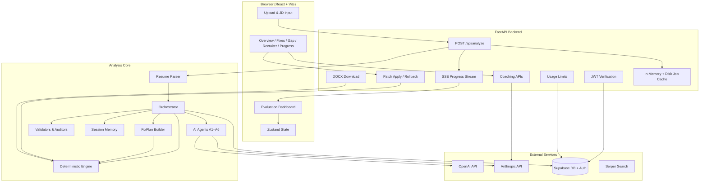
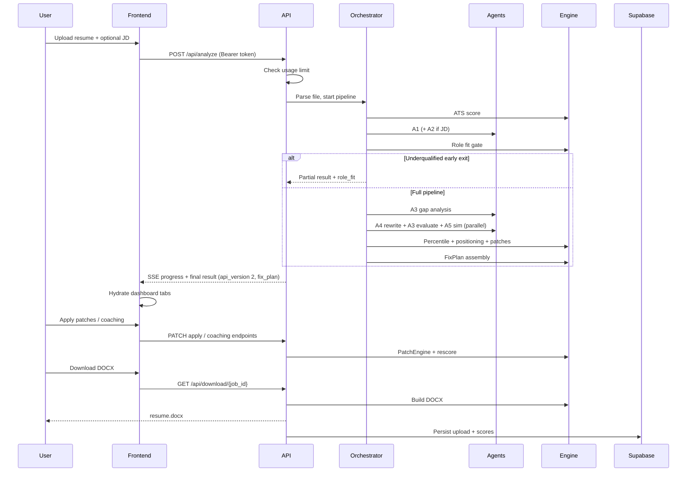

# Resume Intelligence Platform V2 — Architecture

This document describes the complete architecture of the Resume Intelligence Platform (RIP V2) as it exists today. It is written in plain English for engineers, product owners, and stakeholders who need to understand how the system is organized, how data flows through it, and how the major pieces relate to one another.

---

## 1. Purpose and Scope

The platform helps software engineers in India (roughly fresher through staff level) evaluate and improve their resumes. It accepts a resume file plus an optional job description, then produces:

- An ATS readiness score and breakdown
- Structured understanding of the candidate’s background
- Job-description match analysis and prioritized gaps
- Rewrite suggestions in multiple styles
- Optional recruiter simulation across ten personas
- Percentile benchmarking and career positioning guidance
- Exportable Word documents with applied fixes
- A unified **FixPlan** — one deterministic action per gap for the Fixes tab (coaching, surgical patch, keyword surface fix, rewrite block, or info-only)

The system is designed around a **multi-agent AI pipeline** coordinated by a central orchestrator, with **deterministic engines** handling scoring, patching, FixPlan assembly, and export so that critical numbers and document changes remain predictable and auditable.

---

## 2. High-Level System Overview

The project is a **full-stack application** with three major layers:

| Layer | Role |
|-------|------|
| **Web frontend** | React application where users upload resumes, watch analysis progress, explore results across tabs, apply fixes, and download improved documents |
| **API backend** | FastAPI service that accepts uploads, runs the analysis pipeline, streams progress, manages sessions, and serves downloads |
| **Analysis core** | Python modules for parsing, orchestration, AI agents, deterministic scoring, validation, memory, and document generation |

External services involved:

- **OpenAI** — resume understanding (A1), job description intelligence (A2), gap analysis (A3), rewriting (A4)
- **Anthropic** — recruiter simulation (A5), mock interview (A6), coaching bullet generation, and parts of job-description fetching
- **Supabase** — user authentication (JWT), persistent storage of uploads and analysis history, usage limits
- **Serper** — web search for automatic job-description fetching
- **Jina AI Reader** — fallback text extraction for certain job posting URLs

Deployment target is a container-friendly Python server (for example Railway) running Uvicorn, with the React frontend built separately and pointed at the API via environment configuration.

---

## 3. Architecture Diagram

---

## 4. Repository Structure (Conceptual)

Although folder names may evolve, the codebase is organized into clear responsibilities:

| Area | Responsibility |
|------|----------------|
| **Frontend** | User interface, client-side state, API calls, mock data for development, local ATS rescoring for instant feedback |
| **Backend API** | HTTP endpoints, authentication, job lifecycle, caching, persistence hooks |
| **Backend agents** | Isolated LLM-powered units, each with a single job and strict input/output contracts |
| **Backend schemas** | Pydantic models that define what every agent accepts and returns |
| **Orchestrator** | Sequences all steps, handles parallelism, graceful degradation, and assembles the final result |
| **Parser** | Converts PDF, DOCX, and TXT files into clean, section-aware plain text |
| **Engine** | Non-LLM logic: ATS scoring, percentile ranking, career positioning, patch application, FixPlan assembly, DOCX building, surgical export |
| **Validators** | Post-processing checks on agent output, especially experience completeness and rewrite structural integrity |
| **Memory** | Per-user JSON session files storing run history and agent outputs |
| **Data** | Static benchmark files for percentile and compensation-tier mapping |
| **Tests** | Compliance and regression tests across agents, parser, scoring, and pipeline behavior |

There is also a **terminal-oriented gap session module** for interactive CLI-style gap closing and document export, separate from the web flow but sharing the same underlying concepts.

---

## 5. Entry Points

### 5.1 Web API (Primary)

The main production path is the FastAPI application. Users interact through the React frontend, which calls REST and Server-Sent Events endpoints. The API:

- Accepts multipart resume uploads with optional job description text
- Runs analysis in a background worker thread
- Streams step-by-step progress to the client
- Persists completed jobs to disk so downloads survive server restarts
- Enforces authentication and monthly upload limits

### 5.2 CLI Gap Session (Secondary)

A standalone module supports terminal-based interactive review: showing before/after diffs, collecting user accept/reject decisions, and exporting a styled Word document. This path is useful for local workflows and testing but is not the primary user experience.

---

## 6. Resume Ingestion and Parsing

Before any AI work begins, the uploaded file is converted to text.

**Supported formats:** PDF, DOCX, TXT.

**Parsing strategy:**

- PDFs use word-boundary-aware extraction to avoid common problems like merged words in tightly kerned fonts. If standard extraction fails, OCR may be attempted as a last resort.
- DOCX files are read structurally to preserve paragraphs and bullets.
- All formats pass through a multi-pass text cleaning pipeline that normalizes whitespace, fixes common PDF artifacts, rejoins broken bullet continuations, and prepares section blocks.

The parser also provides **deterministic section extraction** (summary, skills, experience, education, and so on). These blocks act as a safety net when AI section parsing is incomplete or empty.

---

## 7. The Orchestrator — Central Coordinator

The orchestrator is the brain of the analysis pipeline. No agent calls another agent directly; only the orchestrator invokes them. This keeps dependencies one-directional and makes the execution order explicit.

### 7.1 Design Principles

- **Parallel where safe:** Independent steps run concurrently using thread pools (not async/await).
- **Sequential where required:** Gap analysis needs resume understanding; rewriting needs gap output.
- **Graceful degradation:** Failures in rewriting, recruiter simulation, or memory writes produce warnings and partial results. Failures in core understanding steps (resume or JD parsing) stop the run.
- **Progress reporting:** Callbacks notify the API layer for SSE updates at meaningful milestones.
- **Caching:** Intermediate agent outputs can be reused when the same resume and job description were recently analyzed.

### 7.2 Standard Analysis Pipeline

The full evaluation follows this order:

1. **ATS scoring (deterministic)** — Immediate baseline score before any LLM call.
2. **Resume understanding (Agent 1)** — Runs alone if no job description is provided; runs in parallel with JD intelligence if a JD is present.
3. **JD intelligence (Agent 2)** — Only when a job description exists. Extracts role title, required skills, seniority expectations, company type, and hidden hiring signals.
4. **Section merging and experience hardening** — Combines AI-extracted sections with deterministic parser blocks and a dedicated sectioner agent when needed. Experience entries are audited so no company or role is dropped before rewriting.
5. **Role fit gate (deterministic)** — When a JD exists, the system computes whether the candidate is qualified, stretch, or underqualified. If clearly underqualified, the pipeline exits early to save cost; the frontend can still show role-fit guidance and let the user opt in to a full run.
6. **Gap analysis (Agent 3)** — Compares resume structure and content against JD requirements. In resume-only mode, gaps are derived from Agent 1’s improvement areas and weaknesses instead.
7. **Parallel downstream work:**
   - **Rewriting (Agent 4)** — Produces section-level rewrites and surgical patches.
   - **Gap evaluation (Agent 3, evaluate mode)** — Estimates JD match score after fixes when a JD is present.
   - **Recruiter simulation (Agent 5, optional)** — Simulates ten recruiter personas when requested.
8. **Percentile ranking (deterministic)** — Maps a composite score to a peer percentile using seniority-specific benchmarks.
9. **Career positioning (deterministic)** — Generates a human-readable positioning statement and tier guidance without LLM calls.
10. **Patch classification** — Tags and deduplicates rewrite patches for the interactive fixes UI.
11. **FixPlan assembly (deterministic)** — `FixPlanBuilder` merges classified `priority_fixes` and `classified_patches` into `fix_plan[]`: one item per actionable gap with a stable `fix_id`, resolved `kind`, pre-linked `patch_id`, and `before_text` / `after_text`. Emitted under `api_version: 2` in the orchestrator result. Failure is non-fatal (empty `fix_plan` with a warning).
12. **Memory persistence** — Saves agent outputs and the full run result for the user’s session file.

### 7.3 Resume-Only Mode

When no job description is supplied, the platform still provides value:

- ATS scoring runs against the resume alone.
- Agent 1 identifies strengths, weaknesses, and improvement areas.
- The orchestrator converts those findings into section-level gaps so the rewriter can still improve the document.
- JD match, role fit, and JD-specific evaluation steps are skipped or nulled.

### 7.4 Composite Scoring Logic

When both ATS and JD match exist, the platform uses a weighted composite:

- **40%** ATS score
- **60%** JD match score

This composite drives percentile calculation and career positioning tier mapping.

---

## 8. AI Agents

Each agent inherits a common base that handles provider selection, JSON parsing with one automatic retry, token limits, and latency tracing. Agents validate inputs and outputs through Pydantic schemas — raw unstructured data exists only at the LLM boundary.

| Agent | Name | Provider | Purpose |
|-------|------|----------|---------|
| **A1** | Resume Understanding | OpenAI (gpt-4o-mini) | Extracts seniority, experience years, tech stack, domains, metrics presence, section map, resume health signals, strengths, and weaknesses |
| **A2** | JD Intelligence | OpenAI (gpt-4.1-mini) | Parses job descriptions into must-have and nice-to-have skills, role title, seniority expectation, company type, semantic skill mappings, and hidden signals |
| **A3** | Gap Analyzer | OpenAI (gpt-4.1) | Identifies section-level gaps, sub-entry changes, missing keywords, coaching questions, and priority fixes. Operates in **gap_closer** mode during analysis and **evaluate** mode to estimate post-fix JD match |
| **A4** | Rewriter | OpenAI (gpt-4.1-mini) | Rewrites only sections flagged as needing change. Produces three styles (balanced, aggressive, top 1%) and generates surgical patches. Enforces anti-hallucination rules — never inventing companies, degrees, or fabricated metrics |
| **A5** | Recruiter Simulator | Anthropic (claude-haiku-4.5) | Simulates ten distinct recruiter personas with first impressions, what they noticed or ignored, rejection reasons, and shortlist decisions. Returns consensus strengths, weaknesses, shortlist rate, and the most critical fix |
| **A6** | Mock Interview | Anthropic (claude-sonnet-4.6) | Separate from the main analysis flow. Generates behavioural questions, evaluates answers with an evaluator-optimizer loop, detects anti-patterns, and returns per-question and session-level feedback. Persisted to Supabase `interview_sessions` |

### 8.1 Auxiliary Agents and Utilities

| Component | Role |
|-----------|------|
| **Sectioner Agent** | Supplementary OpenAI agent that splits raw resume text into structured sections when Agent 1’s section map is thin. The orchestrator merges the richer result. |
| **JD Fetcher Agent** | Searches the web (via Serper) for job postings, classifies ATS provider URLs (Greenhouse, Lever, Workday, etc.), extracts posting text, and returns confidence-scored JD content. Uses deterministic HTML parsing where possible and LLM extraction as fallback. |
| **Coaching Agent** | Turns a user’s free-text answer to a gap-coaching question into a grounded resume bullet, with deterministic fallback if the model call fails. |
| **ATS URL Classifier** | Identifies which applicant-tracking-system provider a URL belongs to so the fetcher can choose the right extraction strategy. |

### 8.2 Agent Contract (Behavioral)

Every agent follows the same lifecycle:

1. Validate incoming data against an input schema.
2. Call the LLM with a system prompt and structured user message.
3. Parse JSON from the response (retry once on parse failure).
4. Validate against an output schema.
5. Return a plain dictionary for the orchestrator to pass downstream.

Agents never import or invoke each other.

---

## 9. Deterministic Engine Layer

These modules deliberately contain **no LLM calls**. They provide reproducible scoring, document manipulation, and export logic.

### 9.1 ATS Scorer

Scores resumes from 0 to 100 across four dimensions (each 0–25):

- **Keyword match** — Action verbs, technology keywords, optional JD overlap boost
- **Formatting** — Section headers, bullet structure, reasonable length
- **Readability** — Approximate reading ease
- **Impact and metrics** — Numbers, percentages, scale and latency indicators

The scorer also produces human-readable issue lists and dimension-level detail for the dashboard.

### 9.2 Percentile Engine

Loads seniority-specific benchmark distributions (junior, mid, senior, staff) from static JSON data. Interpolates the user’s composite score into a percentile rank and label (for example “Top 25%”, “Above Average”).

### 9.3 Career Positioning Engine

Combines ATS score, JD match, percentile, and breakdown gaps to produce:

- A positioning statement tailored to the candidate’s level
- Company tier guidance mapped through compensation-band thresholds
- Rank rationale explaining why the candidate sits where they do

All logic is rule-based using static configuration files.

### 9.4 Role Fit Engine

Deterministic comparison of resume seniority and experience against JD expectations. Returns fitness classification (qualified, stretch, underqualified), a numeric score, experience and seniority gaps, recommended roles, and next-step role suggestions. Used both as an early-exit gate and as dashboard content.

### 9.5 Patch Engine

Applies surgical text patches to resume content without LLM involvement. Supports operations like replacing text, inserting keywords, adding metrics, adding bullets, shortening bullets, and reordering. Tracks applied, rejected, and rolled-back patches. Recalculates ATS score after changes. Enforces risk levels — some patches require explicit user confirmation before application.

### 9.6 Resume Builder and Surgical Export

Builds the final Word document from structured resume sections and accepted rewrites. Preserves all original sections; experience blocks use consistent formatting (company bold, role italic, bullets as list items). When users apply incremental patches rather than full aggressive rewrites, a surgical export path merges patched plain text back into the structured document while keeping formatting intact.

### 9.7 LLM Trace

A lightweight observability module records per-agent LLM call duration and non-LLM phase timing for each orchestrator run. This supports latency diagnosis in server logs without affecting user-facing behavior.

### 9.8 FixPlan Builder

`backend/engine/fix_plan_builder.py` implements the **single action contract** for the Fixes tab. It runs after patch classification and before the final result is returned. Inputs are already-classified `priority_fixes` (from gap analysis) and `classified_patches` (from the orchestrator), plus A1 `resume_sections` for verbatim `before_text` lookup.

Each output item (`FixPlanItem`) includes:

| Field | Role |
|-------|------|
| `fix_id` | Stable key: `{section}\|{entry_id}` for canonical IDs, `{section}\|{slug(sub_label)}` for derived IDs, or `{section}\|__section__` for section-level fixes |
| `kind` | One of `coaching`, `surgical_patch`, `surface_keyword`, `rewrite_block`, `info_only` |
| `patch_id` | Pre-resolved patch reference (never set for coaching items) |
| `before_text` / `after_text` | Resolved from patch text, A1 verbatim sub-entries, or fix fields; rewrite markers stripped |
| `issue`, `missing_keywords`, coaching fields | Passed through from the priority fix |

**Kind dispatch (priority order):**

1. `requires_user_input` or `gap_type=evidence` → **coaching** (even if a patch exists)
2. Usable `replace_text` patch with original + replacement → **surgical_patch**
3. `gap_type=surface` → **surface_keyword**
4. Resolvable rewrite text on the fix → **rewrite_block**
5. Otherwise → **info_only**

**Patch lookup rules:**

- Canonical `entry_id` → exact `sub_entry_id` match only
- Derived or absent `entry_id` with a `sub_label` → no entry-level patch (prevents wrong-company bleed)
- Section-level fixes (no `sub_label`) → first patch in the section-wide pool (patches without `sub_entry_id`)

Items are deduplicated by `fix_id` (first wins). The orchestrator attaches the list as `fix_plan` with `api_version: 2`. Early-exit runs (e.g. underqualified role-fit gate) return an empty `fix_plan`.

---

## 10. Validation and Quality Gates

Several validators sit between agent output and user-facing results:

| Validator | Purpose |
|-----------|---------|
| **Resume Understanding Validator** | Corrects and enriches Agent 1 output against raw resume text |
| **Rewriter Validator** | Ensures rewrites preserve structure, experience markers, and section completeness |
| **Structural Completeness Checks** | Confirms every resume section has a corresponding rewrite entry; backfills missing sections from originals when needed |
| **Experience Audit** | Counts and reconciles experience sub-entries against ground-truth detection from raw text. Runs at multiple pipeline checkpoints and before DOCX download |

These gates enforce a key product invariant: **the exported document must contain all original resume sections**, with unchanged sections copied verbatim and placeholders never written into final output.

---

## 11. Memory and Persistence

The platform uses two persistence strategies.

### 11.1 Local Session Memory (JSON files)

Each user has a JSON file storing:

- Run history with timestamps and scores
- Accepted and rejected rewrite style decisions
- Per-run agent output keyed by run identifier

This supports style fingerprinting, session continuity, and debugging. Storage is capped (maximum runs per user) to prevent unbounded growth.

### 11.2 Supabase (Cloud)

Used for production user features:

| Table / Feature | Purpose |
|-----------------|---------|
| **Auth** | Supabase JWT tokens verified by the backend on protected routes |
| **resume_uploads** | Metadata for each uploaded file (name, size, JD text, target role) |
| **analysis_results** | Denormalized scores plus full result payload linked to uploads |
| **usage_limits** | Monthly upload counters for free-tier enforcement |

The frontend reads analysis history directly from Supabase for authenticated users. The backend writes to Supabase after each successful analysis.

### 11.3 Job Cache (Server Local)

During an active analysis session, job state lives in an in-memory store backed by JSON files on disk. This cache holds:

- Parsed resume text and patched variants
- Full analysis result
- Applied coaching answers
- Progress events for SSE replay

Job cache and stage cache (Agent 1 / Agent 2 / recruiter sim outputs keyed by resume and JD hash) reduce repeat LLM cost and survive API process restarts for downloads.

---

## 12. API Layer

### 12.1 Core Analysis Endpoints

| Endpoint | Behavior |
|----------|----------|
| **POST /api/analyze** | Accepts resume file, optional JD, optional recruiter sim flag. Returns an SSE stream with step events and a final complete result payload including job identifier |
| **GET /api/stream/{job_id}** | Poll-based SSE replay of progress events for a running or completed job |
| **GET /api/result/{job_id}** | Polling fallback returning status, result, and latest progress |
| **GET /api/usage-limit** | Pre-flight check of remaining monthly analyses for the authenticated user |

### 12.2 Job Description Helpers

| Endpoint | Behavior |
|----------|----------|
| **POST /api/fetch-jd** | Given company name and role title (or direct URL), searches and extracts job description text |

### 12.3 Fixes, Patches, and Export

| Endpoint | Behavior |
|----------|----------|
| **POST /api/patches/apply** | Applies selected surgical patches to the session resume text and returns updated score |
| **POST /api/patches/rollback** | Reverts one or all applied patches |
| **GET /api/session/{id}/rescore** | Recalculates ATS from current patched document state |
| **GET /api/session/{id}/download** | Verifies applied patches and approved coaching bullets exist in the document |
| **GET /api/download/{job_id}** | Generates and returns a Word document for the chosen rewrite style |
| **POST /api/gap-close** | Re-runs gap-close rewrite flow for an existing job |

### 12.4 Coaching Endpoints

| Endpoint | Behavior |
|----------|----------|
| **POST /api/coaching/generate-bullet** | Converts user’s coaching answer into a resume bullet |
| **POST /api/coaching/add-bullet** | Inserts an approved bullet into the session’s experience section |
| **GET /api/coaching/career-memory** | Returns stored coaching entries for the session |

### 12.5 Mock Interview Endpoints

| Endpoint | Behavior |
|----------|----------|
| **POST /api/interview/questions** | Generate behavioural questions from resume + JD context |
| **POST /api/interview/session/start** | Create a persisted interview session |
| **POST /api/interview/session/{id}/answer** | Submit an answer; Agent 6 evaluates |
| **POST /api/interview/session/{id}/summary** | Final session summary and dimension scorecard |
| **GET /api/interview/sessions** | List completed sessions for the authenticated user |

### 12.6 Authentication Flow

The frontend uses Supabase client-side authentication. Protected API calls include a Bearer token. The backend verifies tokens against Supabase JWKS (modern ES256) or legacy HS256 secret. Unauthenticated requests receive 401 responses.

---

## 13. Frontend Architecture

### 13.1 Technology Stack

- React 18 with TypeScript and Vite
- Tailwind CSS for styling
- Zustand for global application state
- React Query for server-state caching
- Axios and native fetch for API communication
- Recharts for progress visualization
- Supabase client for auth and history

### 13.2 Application Views

The app has three primary screens:

1. **Upload** — Resume file selection, optional job description entry (manual or fetched), usage limit check, and analysis trigger
2. **Progress** — Real-time step labels and percentage while the backend pipeline runs
3. **Dashboard** — Tabbed results experience once analysis completes

### 13.3 Dashboard Tabs

All five tabs exist in the DOM simultaneously and are toggled with CSS visibility (not unmounting), which keeps state stable when switching views:

| Tab | Purpose |
|-----|---------|
| **Overview** | ATS and JD scores, percentile, role fit banner, priority actions, dimension breakdowns, career positioning, verdict summary |
| **Actionable Fixes** | FixPlan-driven patch cards, coaching questions, apply/rollback controls, live rescoring |
| **Gap Closer** | Section-level gap detail, skills grid, match score hero, action plan |
| **Recruiter View** | Ten persona cards, shortlist rate, consensus strengths and weaknesses |
| **Progress** | Score snapshots over time, career record entries, download and verification status |

### 13.4 State Management

**Resume store** holds the active job identifier, full analysis result, selected rewrite style, accepted sections, active tab, loading and error flags, baseline ATS for comparison, section overrides from applied fixes, and role-fit opt-in state.

**Auth store** holds the Supabase session and user profile.

**Progress store** tracks score snapshots, career record entries, and counts of applied patches and coaching answers for the progress tab.

### 13.5 Client-Side Deterministic Scoring

The frontend includes a mirrored ATS scorer so users see immediate score updates when applying section fixes locally, without waiting for a server round-trip. Live scores are capped at the baseline from the initial analysis to avoid confusing regressions during partial edits.

### 13.6 FixPlan Client Adapter

`frontend/src/utils/fixPlanAdapter.ts` is the sole translation layer from backend `FixPlanItem` to the legacy `PriorityFix` shape consumed by card components (`StructuralPatchCard`, `SurfacePatchCard`, `EvidenceCoachingCard`, etc.).

- **`buildFixesFromPlan`** — reads `analysisResult.fix_plan`, filters out `info_only` (and optionally evidence/coaching gaps), maps to `PriorityFix[]`
- **`resolvePatchFromPlan`** — looks up `ResumePatch` by the pre-resolved `_patch_id` bridge field (replaces client-side `resolvePatchForFix` heuristics for new sessions)
- **`buildGapDiagnostics`** — returns the full `fix_plan` including `info_only` items for the Gap tab
- **Stale-session guard** — when `api_version < 2` or `fix_plan` is absent, falls back to `buildActionableFixesList` with a console warning (cached sessions pre-dating the migration only)

`ActionableFixes.tsx` imports `buildFixesFromPlan` and `resolvePatchFromPlan` exclusively for new sessions.

### 13.7 Development Mode

A mock-data flag allows the entire UI to render with static sample analysis results and simulated SSE progress, enabling frontend development without a running backend or API keys.

### 13.8 Mock Interview UI

A separate `MockInterview` view calls `/api/interview/*` endpoints. It does not share the main analysis orchestrator path; Agent 6 runs on demand after the user submits answers.

---

## 14. End-to-End User Journey

---

## 15. Scoring and Benchmark Model

### ATS Dimensions (0–100 total)

Each dimension contributes up to 25 points. Issues are surfaced when a dimension falls below internal benchmark thresholds for that dimension.

### JD Match (0–100)

Produced by Agent 3 during gap analysis. An evaluate-mode pass estimates the score after applying suggested fixes.

### Percentile Bands

Static benchmarks per seniority level define average scores and percentile anchor points (25th, 50th, 75th, 90th). The user’s composite score is interpolated into a percentile rank.

### Recruiter Shortlist Rate

Agent 5 returns the fraction of simulated personas who would shortlist the candidate (0 to 1), displayed as a percentage in the UI.

---

## 16. Anti-Hallucination and Safety Rules

The rewriter and coaching flows enforce strict content grounding:

- Never invent employers, degrees, institutions, years of experience, project names, or specific metrics
- When quantified impact is missing, placeholders like percentage, user count, or latency markers may appear in suggestions but are blocked from final document export
- Coaching bullets must pass a grounding check against the user’s raw answer
- High-risk patch operations (adding metrics or new bullets) may require explicit user confirmation

---

## 17. Caching Strategy

| Cache | Key | TTL | Purpose |
|-------|-----|-----|---------|
| **Stage cache** | Hash of resume bytes + JD text | Configurable (default one hour) | Reuse Agent 1, Agent 2, and recruiter sim outputs for identical inputs |
| **Job cache** | Job UUID | Until manually cleared | Persist session state across API restarts |
| **JWKS cache** | Supabase auth keys | One hour | Reduce auth verification latency |

Stage cache can be disabled by setting TTL to zero.

---

## 18. Observability and Operations

- Structured logging throughout agents, orchestrator, and API with warning-level capture of non-fatal failures
- LLM trace summaries at the end of each orchestrator run for latency breakdown
- Experience audit logs at pipeline checkpoints for debugging missing roles in export
- Surgical debug snapshots written around patch apply and download for troubleshooting document state
- Health endpoints for platform and deployment probes

---

## 19. Configuration and Secrets

All secrets load from a root environment file (never committed):

- OpenAI API key — Agents 1, 2, 3, 4
- Anthropic API key — Agent 5, Agent 6 (interview), coaching, JD fetcher rescue paths
- Supabase URL, service role key, and optional JWT secret
- Serper API key — JD fetcher search
- CORS allowed origins for frontend domains
- Free tier monthly upload limit
- Stage cache TTL

---

## 20. Testing Strategy

Automated tests cover:

- Agent schema compliance and output shape
- Parser edge cases (PDF fragmentation, DOCX corruption, experience header parsing)
- ATS scoring and semantic booster behavior
- Gap analyzer contracts and classification
- Rewriter experience preservation
- Role fit computation
- LLM trace utilities
- Stage cache TTL behavior
- FixPlan builder kind dispatch, patch_id contract, deduplication, and wrong-company bleed prevention (`tests/test_fix_plan_builder.py`)

Tests run via pytest. Frontend verification includes TypeScript compilation, production build, and mock-render checks.

### Analysis Result Versioning

| `api_version` | Meaning |
|---------------|---------|
| **1** (legacy) | No `fix_plan`; frontend uses `buildActionableFixesList` heuristics |
| **2** (current) | Includes `fix_plan[]`; Fixes tab uses `fixPlanAdapter` |

All new orchestrator runs emit `api_version: 2`.

---

## 21. Design Principles Summary

| Principle | Implementation |
|-----------|----------------|
| **Separation of concerns** | Agents are isolated; orchestrator coordinates; engine handles deterministic work |
| **Schema-first contracts** | Pydantic validation at every agent boundary |
| **Cost awareness** | Role fit early exit, stage caching, optional recruiter sim |
| **Graceful degradation** | Non-critical failures warn and continue; core failures stop the run |
| **Document integrity** | Multiple validation and audit passes before export |
| **No LLM for scores that users trust as objective** | ATS, percentile, positioning, role fit, FixPlan assembly, and patching are all deterministic |
| **Parallelism without async complexity** | Thread pools for independent agent calls |
| **User control** | Three rewrite styles, patch apply/rollback, coaching opt-in, underqualified gate override |

---

## 22. Known Architectural Boundaries

Understanding what the system explicitly does **not** do clarifies its scope:

- It is not a job application tracker or ATS applicant portal integration
- It does not store raw resume files long-term in cloud storage by default — text is parsed in-session and metadata is persisted
- It does not guarantee job offers or interview outcomes — recruiter simulation is illustrative
- CLI and web paths share concepts but are not fully unified into one interface
- History in the frontend reads from Supabase, not from the local JSON memory files

---

## 23. Future-Ready Extension Points

The architecture supports extension without restructuring:

- New agents can be added behind the orchestrator with new schemas
- Additional deterministic engines can plug into the post-agent pipeline
- New API routes can attach to the existing job store and patch engine
- Frontend tabs can consume new result fields from the combined orchestrator output
- Alternative LLM providers can be supported through the shared base agent abstraction

---

*This document reflects the architecture as of June 2026, including the FixPlan single-action contract (`api_version: 2`). For API request and response shapes, see `frontend/API_CONTRACT.md`. For development conventions and agent model assignments, see `CLAUDE.md`. For a shorter onboarding overview, see `README.md`.*
